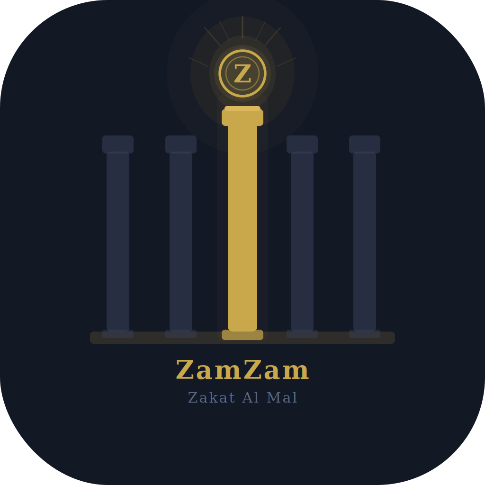

# ZamZam — Zakat Al Mal Tracker

<p align="center">
  
</p>

<p align="center">
  <em>An automated, personal Zakat al-Mal tracker for iOS</em>
</p>

<p align="center">
  
  
  
</p>

---

## What is ZamZam?

ZamZam is an iOS app that automates Zakat al-Mal (obligatory annual charity) calculation and tracking. It pulls your financial account balances daily, tracks nisab against live gold prices, counts your hawl (lunar year) cycle, and notifies you when Zakat is due.

**This app is a calculation tool, not a scholarly authority.** It implements a specific set of jurisprudential rules (see below) — always consult a qualified scholar for rulings specific to your situation.

### Features

- **Automated balance syncing** via [SimpleFIN Bridge](https://beta-bridge.simplefin.org) — supports thousands of banks, brokerages, and credit unions
- **Live nisab calculation** — 85 grams of gold at current market price, updated daily via [GoldAPI.io](https://www.goldapi.io)
- **Hijri lunar calendar** — hawl tracking uses the Umm al-Qura Islamic calendar (~354 days), not the Gregorian calendar
- **Continuous hawl tracking with reset** — if your wealth drops below nisab at any daily check, the hawl resets and restarts when wealth returns to nisab
- **Home screen and lock screen widgets** — glanceable status without opening the app
- **Smart notifications** — reminders at 30 days, 7 days, and when zakat is due
- **Payment recording** — track when and where you paid your zakat
- **Manual asset entry** — for physical cash, gold, silver, and anything SimpleFIN can't see

### Jurisprudential Rules Used

| Rule | Implementation |
|------|---------------|
| Nisab standard | 85 grams of gold |
| Hawl (lunar year) | Umm al-Qura Islamic calendar |
| Nisab tracking mode | Continuous — any dip below nisab resets the hawl |
| Zakat rate | 2.5% of total zakatable wealth at hawl completion |
| Retirement accounts | Zakatable amount = current value minus early withdrawal penalties |
| Brokerage holdings | Fully zakatable (stocks, ETFs, crypto, cash) |
| Bank balances | Fully zakatable |

If your school of thought or scholar advises different rules (bookend nisab tracking, debt deductions, grace periods, etc.), you can fork this repo and modify the `ZakatEngine` accordingly.

---

## Prerequisites

Before you build, you'll need:

1. **A Mac** with [Xcode 15+](https://developer.apple.com/xcode/) installed
2. **An Apple Developer account** — free accounts work for personal use (7-day sideloading). A [$99/year paid account](https://developer.apple.com/programs/) lets you install permanently
3. **A SimpleFIN Bridge account** — [$15/year](https://beta-bridge.simplefin.org) for automated balance syncing. Connect your banks and brokerages through their dashboard
4. **A GoldAPI.io account** — [free tier](https://www.goldapi.io) provides ~300 requests/month (the app needs ~30)

---

## Getting Started

### 1. Clone the repository

```bash
git clone https://github.com/YOUR_USERNAME/zamzam-zakat-tracker.git
cd zamzam
```

### 2. Open in Xcode

```bash
open zakat-al-mal-app.xcodeproj
```

### 3. Configure signing

In Xcode:
- Select the project in the navigator (top-level blue icon)
- Select the **zakat-al-mal-app** target
- Go to the **Signing & Capabilities** tab
- Under **Team**, select your Apple Developer account
- Xcode will automatically create a provisioning profile

Repeat for the **Widget Extension** target if present.

### 4. Create an App Group

The main app and widget share data through an App Group:

1. Go to the [Apple Developer Portal](https://developer.apple.com/account/resources/identifiers/list/applicationGroup)
2. Create a new App Group with identifier: `group.com.YOURNAME.zakat-al-mal-app`
3. In Xcode → target → **Signing & Capabilities** → click **+ Capability** → add **App Groups**
4. Select the App Group you just created
5. Do the same for the Widget Extension target
6. Update the App Group identifier in the code if it differs from the default

### 5. Get your API keys

**SimpleFIN:**
1. Sign up at [beta-bridge.simplefin.org](https://beta-bridge.simplefin.org)
2. Connect your financial institutions (banks, brokerages, credit unions)
3. Create a **Setup Token** in the SimpleFIN dashboard
4. You'll paste this into the app on first launch

**GoldAPI.io:**
1. Sign up at [goldapi.io](https://www.goldapi.io)
2. Copy your API key from the dashboard
3. Add it to the app's Settings screen on first launch

### 6. Build and run

1. Connect your iPhone or select a simulator
2. Press `Cmd + R` or click the Play button
3. On first launch, go to Settings and configure SimpleFIN and GoldAPI
4. Add any manual assets (physical cash, gold, silver)

If running on a physical device for the first time, you may need to trust the developer certificate: **Settings → General → VPN & Device Management → [your email] → Trust**.

---

## Architecture

ZamZam follows MVVM with a clean domain layer that has zero Apple framework dependencies (except Foundation).

```
┌─────────────────────────────────────────┐
│          Presentation Layer             │
│     SwiftUI Views + WidgetKit           │
├─────────────────────────────────────────┤
│          ViewModel Layer                │
│     @Observable classes                 │
├─────────────────────────────────────────┤
│          Domain Layer                   │
│  ZakatEngine · HawlTracker · NisabMon  │
│  (Pure Swift, no framework deps)        │
├─────────────────────────────────────────┤
│          Data Layer                     │
│  SwiftData · SimpleFIN · GoldAPI        │
│  Keychain · Background Sync             │
└─────────────────────────────────────────┘
```

### Key Domain Objects

- **`ZakatEngine`** — Core calculation orchestrator. Computes zakatable wealth, evaluates hawl status, calculates the 2.5% obligation.
- **`HawlTracker`** — Manages the Hijri lunar year cycle. Computes hawl start/end dates, days remaining, and whether the hawl is complete.
- **`NisabMonitor`** — Computes the nisab threshold (85g gold × current price per gram) and checks whether total wealth meets it.

### Data Flow

1. **SimpleFIN** syncs account balances daily via background refresh
2. **GoldAPI** fetches the current gold price once per day
3. **NisabMonitor** computes the threshold from the gold price
4. **ZakatEngine** sums zakatable assets, checks against nisab, evaluates hawl
5. **Widget** reads shared data from the App Group container
6. **Notifications** fire at hawl milestones and when zakat becomes due

---

## Project Structure

```
zakat-al-mal-app/
├── App/                    # App entry point, background task registration
├── Domain/                 # ZakatEngine, HawlTracker, NisabMonitor
├── Models/                 # SwiftData models (Asset, HawlRecord, etc.)
├── Services/               # SimpleFIN client, GoldAPI client, Keychain
├── ViewModels/             # Dashboard, Asset, Payment view models
├── Views/                  # All SwiftUI screens and components
├── Widget/                 # WidgetKit extension
└── Resources/              # Assets, colors, app icon
```

---

## Customization

### Changing jurisprudential rules

The domain layer is intentionally isolated. To adapt the app for a different school of thought:

- **Bookend nisab tracking** (Hanafi/Maliki): In `ZakatEngine.evaluateHawl()`, remove the mid-year nisab check. Only evaluate at hawl start and end.
- **Grace period** (Shafi'i/Hanbali): Add a configurable grace period (0–7 days) before a nisab dip resets the hawl.
- **Debt deductions**: Add a `debtPolicy` to `ZakatEngine` that subtracts debts before calculating zakatable wealth.

### Adding new asset types

Add a new case to `AssetCategory` in `Models/Asset.swift` and update the `zakatableAmount` computed property if the new type has special rules (like the penalty deduction for retirement accounts).

### Using a different gold price API

Implement the `GoldPriceService` protocol with your preferred provider. The app uses one daily request, so any free-tier API will work.

---

## Costs

| Item | Cost | Required? |
|------|------|-----------|
| Apple Developer Program | $99/year | For permanent install. Free account works with 7-day re-signing |
| SimpleFIN Bridge | $15/year | For automated balance syncing. You can skip this and use manual entry only |
| GoldAPI.io | Free | Free tier is more than sufficient |

**Minimum cost for full automation: $114/year.** Manual-entry-only mode is free (with a free Apple Developer account and re-signing weekly).

---

## Contributing

Contributions are welcome. Some areas where help would be especially valuable:

- **Madhab-specific rule sets** — implementing the `MadhabRuleSet` protocol from the original architecture for Hanafi, Maliki, Shafi'i, and Hanbali schools
- **Localization** — Arabic, Urdu, Malay, Turkish, French translations
- **Additional financial integrations** — direct API clients for specific brokerages
- **Silver nisab option** — 612.36g silver as an alternative nisab standard
- **Debt tracking and deduction** — madhab-specific debt deduction rules
- **Zakat al-Fitr** — separate tracking for the annual per-person charity at Eid

Please open an issue before starting significant work so we can discuss approach.

---

## Disclaimer

This app assists with Zakat calculation based on a specific set of jurisprudential rules. It is **not** a fatwa, scholarly opinion, or religious authority. Always consult a qualified scholar — such as those at [AMJA](https://www.amjaonline.org) or [FCNA](https://fiqhcouncil.org) — for rulings specific to your situation.

---

## License

This project is licensed under the MIT License — see [LICENSE](LICENSE) for details.

---

<p align="center">
  <em>May Allah accept your Zakat and bless your wealth.</em>
</p>
